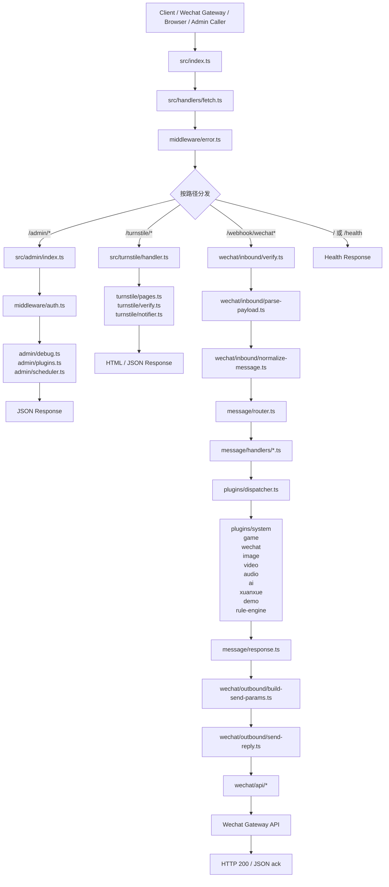
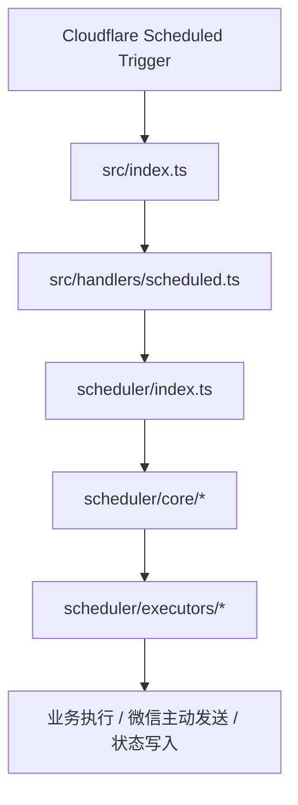
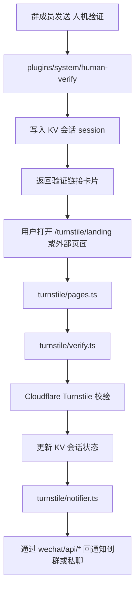

# xchatbot 结构重构蓝图（v1）

> 目标：先统一结构认知与迁移顺序，再开始正式代码迁移。
> 
> 当前结论基于仓库现状、现有 `src/index.ts` / `src/wechat/*` / `src/plugins/*` / `src/scheduler*` / `src/turnstile/*` 的实际职责，而不是套用通用模板。

---

## 1. 重构目标

本次重构不是单纯“拆大文件”，而是要同时解决下面 4 类问题：

1. **入口层过重**
   - `src/index.ts` 同时承担 Worker 入口、HTTP 路由、admin、debug forward、turnstile、scheduler 桥接。
2. **微信平台适配层耦合过深**
   - `src/wechat/index.ts` 混合了入站解析、标准化、白名单、回复发送、媒体降级。
   - `src/wechat/api.ts` 体量过大，接口能力堆叠。
3. **消息处理链边界不清**
   - `handlers/`、`bot/`、`plugins/` 三层的职责容易混淆。
4. **规则系统与插件系统关系未显式表达**
   - `common / dynamic / workflow` 已不是简单“几个插件文件”，但又与插件运行时强相关。

---

## 2. 当前阶段范围

为了降低风险，本轮蓝图聚焦以下内容：

1. **优先理顺主业务边界**
   - 先完成入口层、控制面、消息层、微信适配层、插件层、调度层的职责收口。
2. **保持对外行为稳定**
   - 迁移初期保持现有路由、管理接口、插件命令、调度入口兼容。
3. **将规则系统作为插件生态中的规则型执行引擎演进**
   - 统一落到 `plugins/rule-engine/`。
4. **按阶段推进迁移**
   - 先入口、再控制面、再消息层、再微信适配层、最后处理规则与调度收尾。

---

## 3. 设计原则

### 3.1 入口最薄

- `src/index.ts` 只负责导出 Worker 入口。
- 真正逻辑下沉到 `handlers/`。

### 3.2 平台适配与业务处理分离

- `wechat/` 负责微信平台接入与发送。
- `message/` 负责标准消息路由。
- `plugins/` 负责插件运行时。

### 3.3 横切逻辑单独归位

放入 `middleware/` 的必须是横切关注点，例如：

- 错误边界
- 鉴权
- 调试转发
- 限流

### 3.4 HTTP 控制面与聊天命令面分离

- `admin/`：HTTP 管理接口
- `plugins/*`：聊天消息触发的插件命令，继续按能力域子目录组织（如 `system/`、`game/`、`wechat/`）

### 3.5 承认规则系统的独立复杂度

`common / dynamic / workflow` 不再只看作“几个普通插件”，而是视为：

> 插件系统中的一类规则型执行引擎（rule engine）

因此统一采用：

- 规则型执行引擎整体落到 `plugins/rule-engine/`
- 在插件系统内部保持清晰的模块边界与独立复杂度表达

---

## 4. 目标目录结构

```text
src/
├── index.ts
├── handlers/
│   ├── fetch.ts
│   └── scheduled.ts
│
├── middleware/
│   ├── error.ts
│   ├── auth.ts
│   ├── debug-forward.ts
│   └── rate-limit.ts
│
├── admin/
│   ├── index.ts
│   ├── debug.ts
│   ├── plugins.ts
│   └── scheduler.ts
│
├── wechat/
│   ├── index.ts
│   ├── inbound/
│   │   ├── verify.ts
│   │   ├── parse-payload.ts
│   │   └── normalize-message.ts
│   ├── outbound/
│   │   ├── build-send-params.ts
│   │   ├── send-reply.ts
│   │   └── media-pipeline.ts
│   ├── api/
│   │   ├── client.ts
│   │   ├── message.ts
│   │   ├── contact.ts
│   │   ├── chatroom.ts
│   │   ├── media.ts
│   │   ├── account.ts
│   │   ├── miniapp.ts
│   │   └── types.ts
│   ├── builders/
│   ├── constants.ts
│   └── types.ts
│
├── message/
│   ├── router.ts
│   ├── response.ts
│   └── handlers/
│       ├── text.ts
│       ├── image.ts
│       ├── voice.ts
│       ├── video.ts
│       ├── link.ts
│       ├── location.ts
│       ├── event.ts
│       └── default.ts
│
├── plugins/
│   ├── types.ts
│   ├── registry.ts
│   ├── dispatcher.ts
│   ├── plugin-context.ts
│   ├── system/
│   ├── game/
│   ├── wechat/
│   ├── image/
│   ├── video/
│   ├── audio/
│   ├── ai/
│   ├── xuanxue/
│   ├── demo/
│   └── rule-engine/
│       ├── base/
│       ├── dynamic/
│       ├── workflow/
│       ├── remote/
│       └── cache/
│
├── scheduler/
│   ├── index.ts
│   ├── core/
│   ├── executors/
│   └── admin/
│
├── turnstile/
│   ├── handler.ts
│   ├── pages.ts
│   ├── session.ts
│   ├── verify.ts
│   ├── notifier.ts
│   └── shared.ts
│
├── constants/
├── types/
│   ├── env.ts
│   ├── message.ts
│   ├── reply.ts
│   ├── plugin.ts
│   └── scheduler.ts
└── utils/
```

---

## 4.1 重构后的请求流程图

### 总体请求链路



### `scheduled` 链路



### 人机验证插件链路

> 当前 `turnstile/` 的定位不是全站安全网关，而是由 `plugins/system/human-verify` 触发的人机验证娱乐插件配套模块。



---

## 5. 各目录职责说明

## 5.1 `handlers/`

Worker 原生入口层。

- `fetch.ts`：统一处理 HTTP 请求分发
- `scheduled.ts`：统一处理定时调度入口

职责边界：

- 负责 Worker 入口分发与桥接
- 具体 admin、微信解析、插件执行逻辑分别下沉到对应模块

---

## 5.2 `middleware/`

放横切逻辑，而不是平台协议细节。

建议包含：

- `error.ts`：统一错误边界
- `auth.ts`：admin token / 主人身份等横切鉴权
- `debug-forward.ts`：调试请求转发
- `rate-limit.ts`：限流（如后续启用）

补充约定：

- 微信签名校验由 `wechat/inbound/verify.ts` 提供底层实现
- Turnstile 校验由 `turnstile/verify.ts` 提供底层实现
- `middleware/` 负责组合横切逻辑，而不是承载具体平台协议实现

---

## 5.3 `admin/`

独立 HTTP 控制面。

包含：

- `debug.ts`：调试转发开关、配置读取
- `plugins.ts`：插件配置来源状态、规则缓存刷新
- `scheduler.ts`：调度中心管理接口桥接
- `index.ts`：统一组合 admin 路由

职责定位：

当前 `admin` 是：

- 独立 HTTP 路由
- Bearer Token 鉴权
- JSON 响应
- 面向控制台/接口调用方

它与聊天窗口里的管理员命令插件并行存在，各自承担不同入口形态。

---

## 5.4 `wechat/`

微信平台适配层，而不是“XML 协议层模板”的直接照搬。

### `inbound/`

负责“进来”的微信请求：

- `verify.ts`：验签 / 网关校验
- `parse-payload.ts`：原始 payload 解析
- `normalize-message.ts`：转成标准 `IncomingMessage`

### `outbound/`

负责“出去”的回复发送链路：

- `build-send-params.ts`：`ReplyMessage -> WechatApi 参数`
- `send-reply.ts`：发送编排与失败处理
- `media-pipeline.ts`：图片/语音/视频发送前处理与降级

### `api/`

纯微信网关客户端封装，按能力域拆分：

- `client.ts`
- `message.ts`
- `contact.ts`
- `chatroom.ts`
- `media.ts`
- `account.ts`
- `miniapp.ts`
- `types.ts`

### `builders/`

保留聊天记录卡片、联系人卡片等平台构造器。

---

## 5.5 `message/`

标准消息路由层，负责：

- 按 `MessageType` 选择对应处理器
- 标准化 `HandlerResponse`
- 与微信平台细节、插件运行时解耦

这层是当前 `bot/` + 消息类型处理器的重构目标，用来稳定承接消息运行时中层。

---

## 5.6 `plugins/`

插件运行时核心。

### 顶层职责

- `types.ts`：插件接口定义
- `registry.ts`：插件注册与顺序声明
- `dispatcher.ts`：插件匹配与执行
- `plugin-context.ts`：插件执行上下文

### 普通插件目录

普通插件继续保留在 `plugins/` 根目录下，并按能力域子目录组织，例如：

- `system/`
- `ai/`
- `audio/`
- `image/`
- `video/`
- `wechat/`
- `xuanxue/`
- `game/`
- `demo/`

这样做是为了：

1. 保持现有目录认知连续性
2. 降低迁移路径噪音
3. 让规则系统的复杂度提升只体现在 `rule-engine/`，而不是强行把所有普通插件再包一层 `impl/`

### `rule-engine/`

插件生态中的规则型执行引擎，承接当前 `common / dynamic / workflow` 迁移。

采用折中结构是为了同时表达两件事：

1. 它归属于插件系统
2. 它又明显比普通插件实现更复杂

---

## 5.7 `scheduler/`

独立子系统，统一采用明确的核心层 / 执行器层 / 管理层结构。

建议结构：

- `core/`：调度核心、仓储、类型、工具
- `executors/`：执行器注册与实现
- `admin/`：调度管理接口桥接
- `index.ts`：外部统一入口

目标结构统一为：

- `core/`：调度核心、仓储、类型、工具
- `executors/`：执行器注册与实现
- `admin/`：调度管理接口桥接
- `index.ts`：外部统一入口

---

## 5.8 `turnstile/`

当前已呈现为一个小型独立模块，建议拆分而不是继续堆在单文件中。

建议拆分：

- `handler.ts`：路由分发
- `pages.ts`：HTML 页面渲染
- `session.ts`：会话加载/保存
- `verify.ts`：Turnstile token 校验
- `notifier.ts`：微信通知
- `shared.ts`：共享类型与常量

---

## 5.9 `types/`

将当前聚合在 `src/types/message.ts` 的内容拆分：

- `env.ts`
- `message.ts`
- `reply.ts`
- `plugin.ts`
- `scheduler.ts`

这样可以避免：

- `Env` 与消息模型耦合
- 插件类型与消息类型互相污染

---

## 6. 当前目录到目标目录的迁移映射

| 当前路径 | 目标路径 | 说明 |
|---|---|---|
| `src/index.ts` | `src/handlers/fetch.ts` + `src/handlers/scheduled.ts` + 保留超薄 `src/index.ts` | 入口瘦身 |
| `src/bot/index.ts` | `src/message/router.ts` + `src/message/response.ts` | 重构为显式消息运行时中层 |
| `src/handlers/*.ts` | `src/message/handlers/*.ts` | `handlers` 让位给 Worker 入口语义 |
| `src/wechat/index.ts` | `src/wechat/inbound/*` + `src/wechat/outbound/*` + 保留薄 `src/wechat/index.ts` | 拆平台适配层 |
| `src/wechat/api.ts` | `src/wechat/api/*.ts` | 按能力域拆分 |
| `src/plugins/index.ts` | 保留聚合注册入口，并逐步下沉到 `src/plugins/registry.ts` / `src/plugins/dispatcher.ts` | 结束单点耦合 |
| `src/plugins/manager.ts` | `src/plugins/dispatcher.ts`（必要时拆 registry 能力） | 运行时显式化 |
| `src/plugins/types.ts` | `src/plugins/types.ts` / `src/types/plugin.ts` | 视最终类型落位调整 |
| `src/plugins/common/*` | `src/plugins/rule-engine/*` | 规则系统迁移 |
| `src/scheduler/` | `src/scheduler/core/*` + `src/scheduler/admin/*` | 结构化整理 |
| `src/scheduler-ext/*` | `src/scheduler/executors/*` | 合并扩展执行器 |
| `src/turnstile/handler.ts` | `src/turnstile/*` 多文件 | 拆小模块 |
| `src/types/message.ts` | `src/types/*.ts` | 类型拆分 |

---

## 7. 迁移顺序（推荐按阶段执行）

## Phase 1：入口收口（低风险，高收益）

目标：先把主入口瘦下来，不改业务行为。

建议动作：

1. 新建 `src/handlers/fetch.ts`
2. 新建 `src/handlers/scheduled.ts`
3. 从 `src/index.ts` 抽出 admin / debug / health / turnstile / scheduler 路由分发
4. `src/index.ts` 保留极简导出

验收标准：

- 外部路由不变
- 类型检查通过
- `src/index.ts` 体量显著下降

---

## Phase 2：控制面抽离（低风险）

目标：把 HTTP admin 控制面独立出来。

建议动作：

1. 新建 `src/admin/index.ts`
2. 拆出 `debug.ts`
3. 拆出 `plugins.ts`
4. 拆出 `scheduler.ts`
5. 提炼 `middleware/auth.ts`

验收标准：

- `/admin/debug*`
- `/admin/plugins*`
- `/admin/scheduler*`

接口行为不变。

---

## Phase 3：消息运行时重命名（中风险）

目标：理顺 `bot/` + `handlers/` 的边界。

建议动作：

1. 引入 `src/message/router.ts`
2. 引入 `src/message/response.ts`
3. 迁移现有 `src/handlers/*.ts` 到 `src/message/handlers/*.ts`
4. 保留原导出兼容一段时间，再逐步替换引用

验收标准：

- 消息类型分发与 Worker 入口分发彻底解耦

---

## Phase 4：微信平台适配层拆分（中高风险，高收益）

目标：拆掉 `src/wechat/index.ts` 和 `src/wechat/api.ts` 的双大文件结构。

建议动作：

1. 先拆 `src/wechat/api.ts`
2. 再拆 `src/wechat/index.ts` 为 `inbound/` 与 `outbound/`
3. 保留 `src/wechat/index.ts` 为薄聚合入口

验收标准：

- `WechatApi` 仍保留原有外部能力
- 微信消息接收、发送、降级行为不变

---

## Phase 5：规则系统迁移（中高风险，已完成）

结果：原 `plugins/common` 中承载规则系统的实现已迁移至 `plugins/rule-engine/`，`common` 仅保留非规则引擎公共能力与历史文档命名。

建议动作：

1. 建 `src/plugins/rule-engine/`
2. 迁移 `common / dynamic / workflow` 相关实现
3. 将远程配置、缓存、规则来源策略归位
4. 最后调整 admin / plugin 管理相关引用

验收标准：

- 规则读取顺序不变：`inline > KV > remote`
- 缓存刷新接口行为不变
- 主人插件管理命令行为不变

---

## Phase 6：调度与 Turnstile 收尾（中风险）

目标：清理剩余结构债。

建议动作：

1. `scheduler-ext/` 并回 `scheduler/`
2. 拆分 `turnstile/handler.ts`
3. 拆分 `types/message.ts`

---

## 8. 命名与边界约束

### 8.1 `handlers/` 只表示 Worker 入口

迁移后禁止再把“消息类型处理器”放回顶层 `handlers/`。

### 8.2 `admin/` 只表示 HTTP 控制面

聊天消息触发的管理员命令仍属于插件实现，不放入顶层 `admin/`。

### 8.3 `wechat/api/` 与 `wechat/outbound/` 必须分工明确

- `api/`：纯 HTTP client
- `outbound/`：回复发送编排、参数构建、降级策略

### 8.4 `scheduler-ext/` 目录名最终消失

合并后统一落到 `scheduler/executors/`。

---

## 9. 迁移过程中的风险点

1. **导入路径雪崩式修改**
   - 建议按阶段迁移，避免一次性移动大量文件。
2. **副作用注册丢失**
   - 当前 `src/plugins/index.ts` 和 `src/scheduler-ext/index.ts` 都有注册副作用，需要迁移时重点验证。
3. **微信发送链路行为变化**
   - 语音 / 视频 / 图片的降级逻辑不要在重构时顺手改行为。
4. **规则引擎缓存策略偏移**
   - `plugins/rule-engine/remote-config.ts` 需要继续保持原 `common` 阶段的缓存行为等价，避免规则热更新与缓存命中策略发生偏移。

---

## 10. 本蓝图的最终结构基线

本轮重构统一采用以下结构基线：

- `admin/`：HTTP 控制面
- `middleware/`：横切逻辑组合层
- `wechat/`：微信平台适配层
- `message/`：标准消息路由与响应层
- `plugins/`：插件运行时与规则型执行引擎
- `scheduler/`：独立调度子系统
- `turnstile/`：人机验证插件对应的独立模块

这份文档作为后续正式迁移的唯一结构基线。

